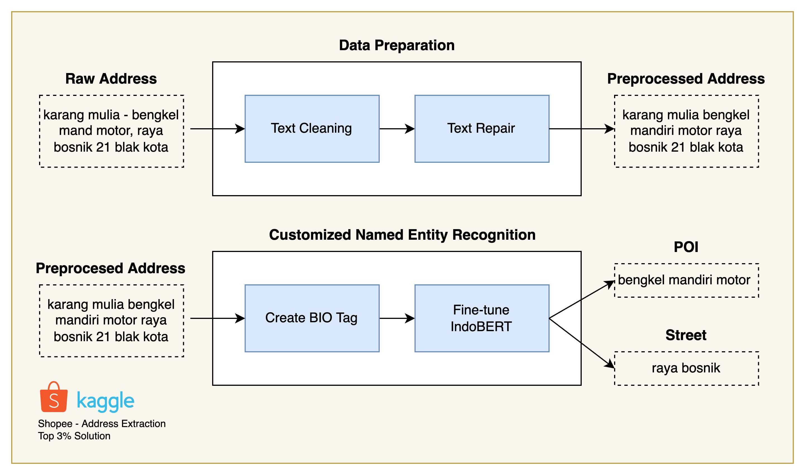

# Address Element Extraction
## Shopee Code League 2021 - Data Science Competition

In this competition, we built an AI solution to correctly extract `point of interest (POI)` names and `street` names from unformatted Indonesia addresses collected by Shopee. We are happy to share our solution, which is ranked 28th (from 1,034 teams) in this competition. Please check the Kaggle's private leaderboard in this [link](https://www.kaggle.com/c/scl-2021-ds/leaderboard).


**Problem Description**

Given a `raw_address`, the AI model should provide two prediction results, one for `POI` and one for `street`. `POI` and `street` should be separated with a “/” character without any spaces in between. There are cases where `POI/street` elements in the `raw_address` are not complete. For this case, the model also need to predict the complete subwords before returning the result.

id | raw_address | POI/street
--- | --- | --- 
1 | karang mulia bengkel mandiri motor raya bosnik 21 blak kota | bengkel mandiri motor/raya bosnik
2 | primkob pabri adiwerna | primkob pabri/
3 | jalan mh thamrin, sei rengas i kel. medan kota | /jalan mh thamrin
4 | smk karya pemban, pon | smk karya pembangunan/pon

Explanation:
1) The `POI` is "bengkel mandiri motor" and `street` name is "raya bosnik" the returned
`POI/street` should be:
    - "bengkel mandiri motor/raya bosnik"
2) The `POI` is "primkob pabri" and no `street` name is found the returned `POI/street` should
be:
    - "primkob pabri/"
3) No `POI` is found and the `street` name is "jalan mh thamrin" the returned `POI/street` should
be:
    - "/jalan mh thamrin"
4) The word "pembangunan" in `raw_address` "smk karya pemban, pon" is not complete. The correct `POI` will be "smk karya pembangunan" and the returned result should be:
    - smk karya pembangunan/pon

## Solution



### 1. Data Preparation

#### 1.1 Data Cleaning
* Drop data which `POI/street` contains dot -> small occurence (0.3% from the data) and can be noisy to the model 
* Clean `raw_address` -> remove multiple whitespace, remove dot, restructure (correct) punctuation, and remove bracket

Please check at `Data-Cleaning.ipynb` for the implementation.

#### 1.2 Data Formatting
* Utilize a probabilistic model to repair texts in the raw address. The probabilistic model employs the frequency information of transformed n-gram from the train data. 

    Examples of frequency information of transformed n-gram:

    * transform_occurency["cak"] = {'cakung': 15, 'cakruk': 1, "cake's": 1, 'cakery': 1, 'cakrad': 1, 'cakrab': 1}

    * transform_occurency["taman mer"] = {'taman meruya': 2}

    In the examples above, the word "cak" in the training data is transformed 15 times into "cakung". For more accurate frequency information, we also utilize bigram, 3-gram, and 4-gram transform_occurence information.

Please check at `Data-Formatting.ipynb` for the implementation

### 2. Modelling

#### 2.1 Modelling Technique

* Assume `POI` and `street` as entities. Frame the problem as named entity recognition (NER), i.e. extract entitites (`POI` and `street`) from texts (`raw_address`) 
* Construct train and test data with BIO tags for custom NER
* Fine-tune IndoBERT model to build custom NER

#### 2.2 Generate Test Design

Split train data into `train` and `validation`. Use test data for submission. Generate BIO tags for creating custom Named Entity Recognition (NER)
```python
python3 create_train_label.py # create train and validation data
python3 create_test_label.py # create test data
```

#### 2.3 Build Custom NER Model

```python
python3 train.py # fine-tune NER model
python3 eval.py # generate csv for submission
```


**Environment**

Before replicating the result, please prepare the environment of the experiment. We run our experiment using Docker, started with [huggingface/transformers-pytorch-gpu:3.4.0](https://hub.docker.com/layers/huggingface/transformers-pytorch-gpu/3.4.0/images/sha256-7e0b2f97aad355f92b27063eef4245ac58e69e8c2113ea9bb0be6b4db23d301a?context=explore) image. You can pull the docker using this command 

```bash
docker pull huggingface/transformers-pytorch-gpu:3.4.0
```

After running the image as a container, please install some required libraries 

```bash
bash install.sh
```


### Model Performance

```bash
(Epoch 16) TRAIN LOSS:0.0020 ACC:1.00 F1:1.00 REC:1.00 PRE:1.00 LR:0.00000500
(Epoch 16) VALID LOSS:0.1394 ACC:0.98 F1:0.94 REC:0.94 PRE:0.94
save model checkpoint at models/bert-large/32_128_3e-05/
(Epoch 17) TRAIN LOSS:0.0019 ACC:1.00 F1:1.00 REC:1.00 PRE:1.00 LR:0.00000500
(Epoch 17) VALID LOSS:0.1440 ACC:0.98 F1:0.94 REC:0.94 PRE:0.94
save model checkpoint at models/bert-large/32_128_3e-05/
```

Thanks for reading :) Don't hestitate to contact me, mhilmiasyrofi(at)gmail(dot)com, if you need further assistance to replicate the result!!!


